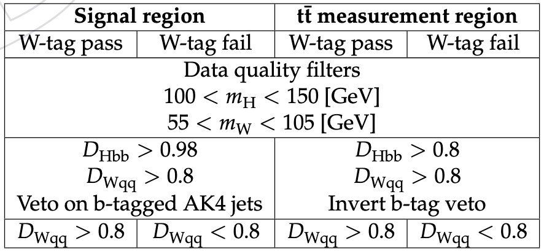

# XHYbbWW semileptonic

Initially adapted from [XHYbbWW](https://github.com/ammitra/XHYbbWW) (Amitav Mitra).

Description: Semileptonic $X \to HY \to bbWW$ analysis, with $W^+W^- \to \ell \nu q\bar{q}$. Analysis is performed predominantly using [TIMBER](https://lucascorcodilos.com/TIMBER/index.html), and the background (QCD) estimate + calibration of Monte Carlo samples is done with [2DAlphabet](https://lucascorcodilos.com/2DAlphabet/) (see [XHYbbWW_BackgroundEstimate](https://github.com/michaelhesford/XHYbbWW_BackgroundEstimate) for this work).

## 1) Set up analysis workspace

### **Condor**
i) Use `condor/tar_env.sh` to create a tarball of the current environment and store it in the EOS.

ii) Create a symlink to the TIMBER CondorHelper script: 
```
ln -s $TIMBERPATH/TIMBER/Utilities/Condor/CondorHelper.py
```

iii) To submit jobs using condor: 
```
python CondorHelper.py -r <RUN SCRIPT>.sh -a <ARGUMENTS FILE>.txt -i "<LOCAL SCRIPTS>"
```

The `-i` option is used to incorporate any scripts which have been created/modified since the last time the environment tarball was updated.


## 2) Grab raw data/MC files using CERN's Data Aggregation System (DAS)

Perform

```
python raw_nano/get_Data.py
python raw_nano/get_MC.py 
```

to get locations of NanoAOD data/MC and store in `.txt` files in the `raw_nano` directory

## 3) Create pileup distributions for pileup weights

Individual jobs: `python XHYbbWW_pileup.py -s <SETNAME> -y <YEAR>`

Batch: run `python condor/pileup_args.py` to produce the arguments file and then

```
python CondorHelper.py -r condor/run_pileup.sh -a condor/pileup_args.txt -i "XHYbbWWpileup.py raw_nano/"
```

to submit the pileup jobs using condor. The outputs are then collected into one local ROOT file called `XHybbWWpileup.root` using

```
python scripts/get_pileup_file.py
```

## 4) Perform snapshots

Snapshots are skims performed on the raw NanoAOD files in order to isolate a smaller set of events/variables which are interesting for the analysis. To do this we impose a very loose set of cuts on the data, and save any desired columns of the resulting RDataFrame in a separate `.root` file. Any future scripts can be run on these snapshot files, saving an enormous amount of time.

Individual job: `python XHYbbWW_snapshot.py -s <SETNAME> -y <YEAR> -j <IJOB> -n <NJOBS>`

The `-n` argument is used to break the initial `.txt` file of ROOT files into a specified number of smaller chunks. The specific chunk to run on is given by the `-i` argument. 

Batch: 

```
python condor/snapshot_args.py
python CondorHelper.py -r condor/run_snapshot.sh -a condor/snapshot_args.txt -i "XHYbbWW_snapshot.py XHYbbWW_class.py HWWmodules.cc"
``` 

Locations of the otuputs can be collected into `.txt` files using `python snapshots/get_snapshots.py`.

## 5) Run basic studies

This step produces basic kinematic plots and N-1 plots for key variables used in the analysis. Given an ensemble of cuts on different variables, we can use the `Nminus1()` function of TIMBER's`analyzer` class to create a set of nodes in which all but one cut is applied. We then plot each variable, for signal and background MC, in the node where cuts on all variables besides itself are applied. These so-called N-1 plots provide insight into the unique contributions of specific cuts on individual variables; we use them to help select working points which maximize the ratio $s/\sqrt{b}$, where $s$ and $b$ are the signal and background yields, respectively.

Individual job: `python XHYbbWW_studies.py -s <SETNAME> -y <YEAR> -j <IJOB> -n <NJOBS>`
Batch: 

```
python condor/studies_args.py
python CondorHelper.py -r condor/run_studies.sh -a condor/studies_args.txt -i "XHYbbWW_studies.py XHYbbWW_class.py HWWmodules.cc"
```

Histograms are stored in `.root` files, which can be grabbed from the EOS and stored in `plots/studies/` using
```
python plots/get_all.py -f studies -g <LIST OF SETNAMES> --combine_years
```

The `--combine_years` option uses the `hadd` function to combine outputs from different years for each setname into full Run2 plots.

Subsequently, run `python studies_plots.py` to produce plots in `png` form. 

**Note:** For correctness, studies (and all scripts involving renormalization) should always be run on the full set of MC for a particular year (njobs = 1), unless just testing code. We renormalize MC samples using using the formula (cross-section) x (luminosity) / (sum of event weights). The event weight sum `genEventSumw` is stored separately for each individual raw NanoAOD file. When multiple files are strung together for a single job, the individual values are added together for the purposes of renormalization. By the laws of *fractions*, renormalizing the full MC by the full sum of event weights will NOT produce the same result as renormalizing smaller chunks by smaller values of `genEventSumw` and then adding those chunks together at the end.

## 6) Make trigger efficiencies

The set of triggers used in the analysis is listed for each primary dataset below; triggers are also stored in `XHYbbWWconfig.json`.

| Year | SingleMuon |
| ---- | ------------------- |
| 2016 | `HLT_IsoMu24` `HLT_IsoTkMu24` `HLT_Mu50` `HLT_TkMu50` |
| 2017 | `HLT_IsoMu27` `HLT_Mu50` `HLT_OldMu100` `HLT_TkMu100` |
| 2018 | `HLT_IsoMu24` `HLT_Mu50` `HLT_OldMu100` `HLT_TkMu100` |

| Year | SingleElectron |
| ---- | ----------------------- | 
| 2016 | `HLT_Ele27_WPTight_Gsf` `HLT_Ele115_CaloIdVT_GsfTrkIdT` |
| 2017 | `HLT_Ele35_WPTight_Gsf` `HLT_Ele32_WPTight_Gsf_L1DoubleEG` `HLT_Ele115_CaloIdVT_GsfTrkIdT` | 

| Year | SinglePhoton |
| ---- | --------------------- | 
| 2016 | `HLT_Photon175` |
| 2017 | `HLT_Photon200` |

| Year | EGamma |
| ---- | --------------- |
| 2018 | `HLT_Ele32_WPTight_Gsf` `HLT_Ele115_CaloIdVT_GsfTrkIdT` `HLT_Photon200` |

--------------------
<ins>DEPRECATED</ins>

Efficiencies are measured for the full suite of triggers in the JetHT dataset, separately for each year. The efficiency, in this case, is the ratio of events which pass most of the event selection (along with several JetHT reference triggers) and the above target triggers vs all events which pass the selection/reference triggers. It was discovered that, during run 2017B, certain triggers were not available. Therefore, including run 2017B into the total 2017 dataset causes the efficiency of the entire year to drop. Therefore, the efficiency is measured separately for 2017B, but this run is dropped from the total 2017 dataset when measuring the efficiency for the whole year. 

Run `XHYbbWW_trigger1D.py` to generate plots of trigger efficiencies as functions of the lepton $p_T$ and $|\eta|$. The script `XHYbbWW_trigger2D.py` performs the same task but produces 2D efficiency histograms which can be fed to TIMBER's `EffLoader` module later on.

Individual job: `python XHYbbWWW_trigger2D.py -y <YEAR>`

Batch: 
```
python condor/trigger_args.py
python CondorHelper.py -r condor/run_trigger2D.sh -a condor/trigger_args.txt -i "XHYbbWW_trigger2D.py XHYbbWW_class.py XHYbbWW_config.json"
```
--------------------

Trigger efficiency measurments and scale factors are now taken from central measurements made by the Muon POG for muon triggers (see [here](https://twiki.cern.ch/twiki/bin/view/CMS/MuonPOG#User_Recommendations)) and from results reported in [this analysis note](https://cms.cern.ch/iCMS/jsp/db_notes/noteInfo.jsp?cmsnoteid=CMS%20AN-2022/124) for electron triggers. Application of the efficiencies/scale factors to Monte Carlo is handled inside `XHYbbWW_selection.py`.

## 7) Run selection + make template histograms

The step performs the remaining selection used in the analysis and produces the template histograms used for the background estimate with 2DAlphabet. Histograms are binned in $m_X$ vs $m_Y$. For each systematic uncertainty considered in the analysis, histograms of the form `syst__nom`, `syst__up`, and `syst__down` are produced, corresponding to the nominal, up ($+1\sigma$), and down($-1\sigma$) variations of that systematic. Such plots are produced in two orthogonal regions of the data: the "signal region", where we expect to observe the signal, and a $t\bar{t}$-enriched measurment region used to calibrate the $t\bar{t}$ Monte Carlo (dubbed the "$t\bar{t}$-MR"). For each region we also construct two sub-regions where the W candidate passes or fails the ParticleNet $W\to qq$ discriminant working point (used for the QCD estimate). These regions are defined by the following criteria. Note that $D_{\text{Hbb}}$ and $D_{\text{Wqq}}$ refer to the Higgs and W tagging discriminants, respectively.



Individual job: `python XHYbbWW_selection.py -s <SETNAME> -y <YEAR> -v <VARIATION> -j <IJOB> -n <NJOBS>`

Batch:

```
python condor/selection_args.py
python CondorHelper.py -r condor/run_selectionHF.sh -a condor/selection_args.txt -i "XHYbbWW_selection.py XHYbbWW_class.py HWWmodules.cc XHYbbWWconfig.json"
```

We also utilize a separate script to make the template histograms used in the fitting procedure for the QCD estimate. These are 2D histograms generated for data and background Monte Carlo where the x-axis is the $D_{\text{Wqq}}$ score of the W candidate jet and the y-axis is just a dummy variable which allows us to perform the fit in 2DAlphabet (in other words, we are interested in performing a 1D fit along the x-axis, and will achieve this in 2DAlphabet simply by assigining a single bin to the y-axis). Histograms are generated in control regions analogous to the SR and $t\bar{t}$-MR defined above, but using the sidebands of the Higgs mass.  

Individual job: `python QCD_rpf.py -s <SETNAME> -y <YEAR> -v <VARIATION> -j <IJOB> -n <NJOBS>`

Batch:

```
python condor/QCDrpf_args.py
python CondorHelper.py -r condor/run_QCDrpf.sh -a condor/QCDrpf_args.sh -i "QCD_rpf.py"
```

## Additional Scripts

`PlotDistributions.py`: Create nice plots showing the data/MC agreement for a variety of interesting distributions. Run: `python condor/distribution_args.py` then `python CondorHelper.py -r condor/run_distributions.sh -a condor/distribution_args.txt -i "PlotDistributions.py"`. Grab the jobs using `plots/get_all.py` and then make the histograms with `python make_control_plots.py`.
`scripts/missing_snapshot_args.py`: Check for any missing snapshot jobs, output is a `.txt` file in the `condor/` directory
`scripts/check_ttrees.py`: Check for any snapshot jobs for which a ttree was not saved, output is a `.txt` file in the `condor/` directory


